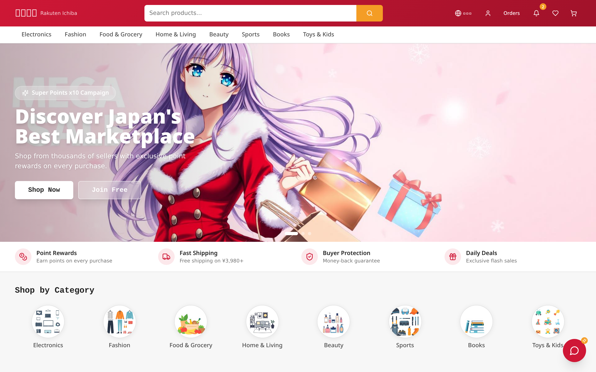
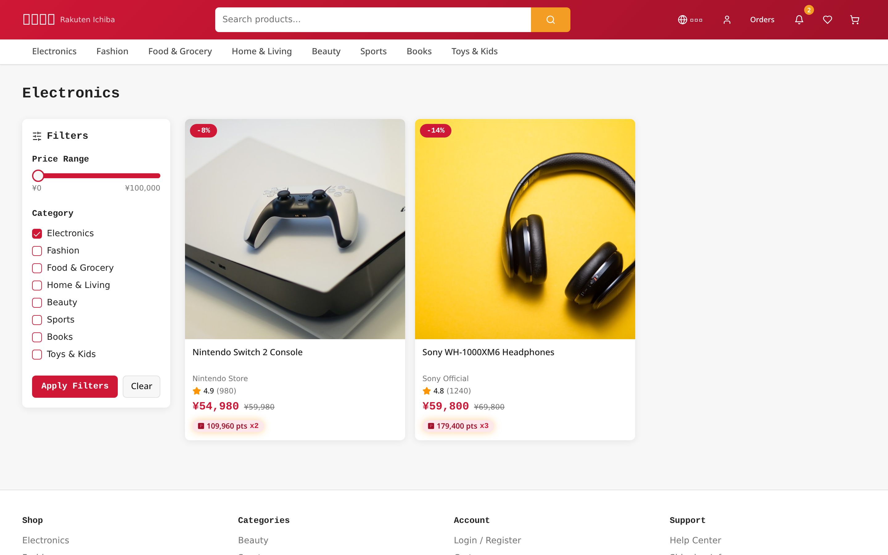
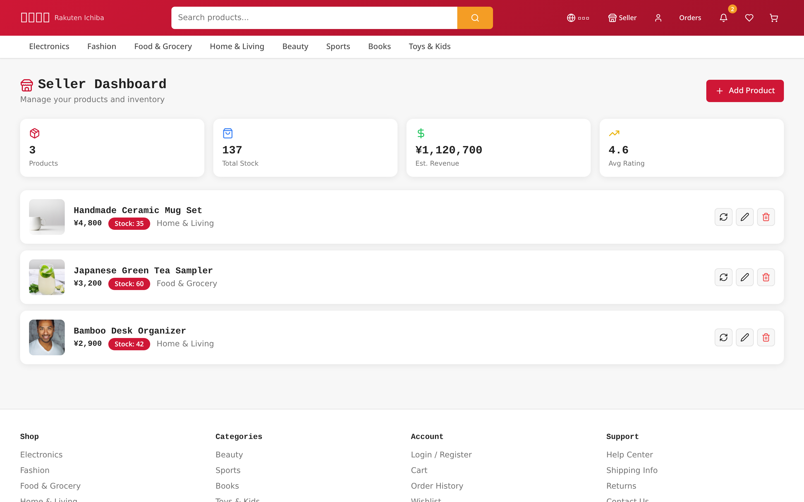
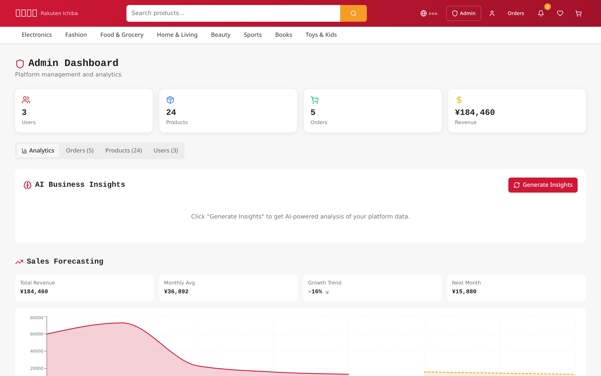
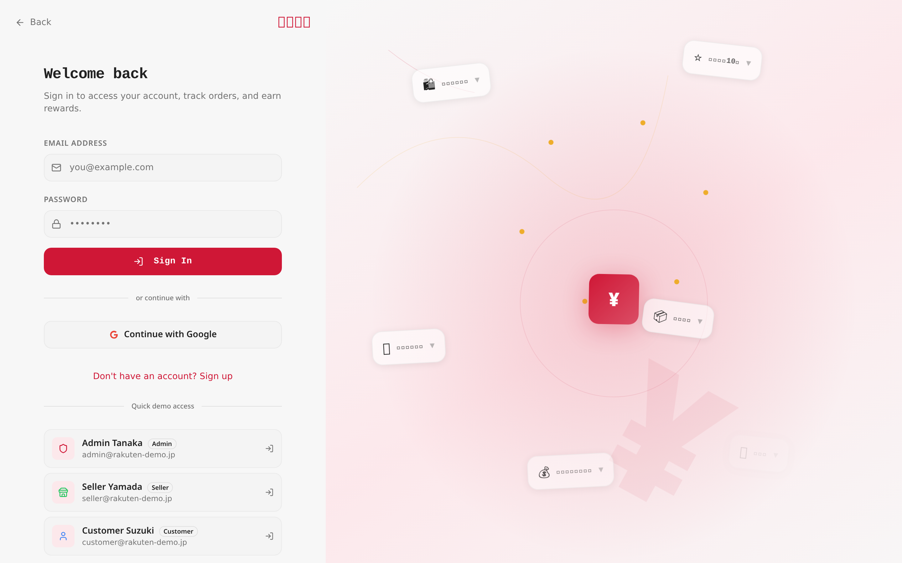
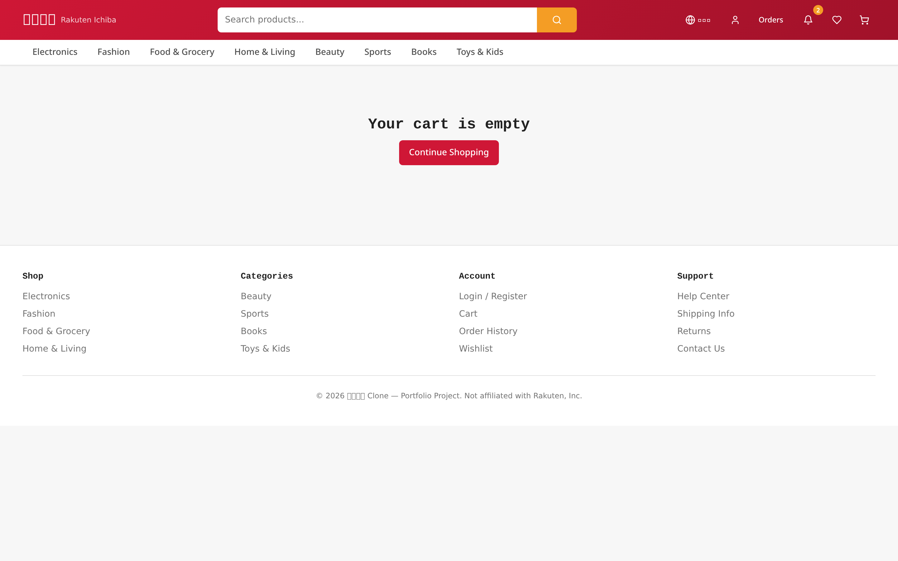

<div align="center">

# 楽天市場 — Rakuten Ichiba Reimagined

<p>
  <em>A production-grade Japanese marketplace clone — built to study the UX and architectural patterns that make 日本のEコマース distinct from Western retail.</em>
</p>

<p>
  
  
  
  
  
  
  
  
</p>

<p>
  🌐 <a href="https://your-url.com"><b>Live Demo</b></a> ・
  🎬 <a href="https://youtube.com/your-video"><b>Demo Video</b></a> ・
  📖 <a href="https://tanmaytrivedi.dev/projects/rakuten"><b>Case Study</b></a> ・
  💼 <a href="https://linkedin.com/in/tanmaytrivedi"><b>LinkedIn</b></a>
</p>



<sub><em>「お買い物マラソン」— Discover Japan's best marketplace, reimagined.</em></sub>

</div>

---

## 一目で分かる · At a Glance

<div align="center">

| 指標 Metric | 数値 Value | 指標 Metric | 数値 Value |
|:--|:--:|:--|:--:|
| 👥 User roles | **3** (Customer / Seller / Admin) | 🗄️ Database tables | **10** |
| 🔒 Application routes | **16** (10 auth-gated) | 🛡️ Row-Level Security policies | **33** |
| 🌐 UI locales | **EN · 日本語** | ⚡ Edge functions | **1**  |
| 🛒 Product catalog | **24 SKUs · 8 categories** | 🎁 Loyalty engine | Points · Coupons · Flash sales |
| 🤖 AI surfaces | Shopping assistant + SEO copy | 🪪 Auth providers | Email + Google OAuth |
| 🔁 Order lifecycle states | **5** (pending → delivered) | 📦 Mock-data parity | 100% feature fallback |

</div>

---

## 概要 · Overview

> **EN —** Rakuten Ichiba Reimagined is a full-stack marketplace that ports the most distinctive parts of 楽天市場 — the point economy, seller-first storefronts, information density, and bilingual service surface — into a modern React + Supabase stack. It exists to demonstrate that I can ship a production-grade Japanese product, not just a CRUD demo.
>
> **日本語 —** 楽天市場の特徴的なUXパターン — ポイント経済、出店者中心のストア構造、情報密度、バイリンガル対応 — をモダンなReact + Supabase構成で再現したフルスタックECです。一般的なCRUDデモではなく、本番品質の日本向けプロダクトを構築できることを示すために制作しました。

---

## 何を証明するか · What This Demonstrates

- **Full-stack delivery** — schema → RLS → API → React → i18n → AI, owned end-to-end.
- **PostgreSQL design with 10 tables and 33 RLS policies** enforced at the database layer.
- **Role-based authorization** with a separate `user_roles` table and `has_role()` SECURITY DEFINER pattern — no privilege-escalation vector.
- **Internationalization (i18n)** — every visible string ships in Japanese and English; JP is the design-first locale.
- **Edge-deployed AI** — Supabase Edge Function fronting the Lovable AI Gateway powers the shopping assistant and SEO description generator.
- **Resilience-first frontend** — slow-connection fallback, optimistic React Query mutations, persistent mock-data layer when the network is unreachable.
- **Japanese e-commerce UX research, applied** — point multipliers (`x2`, `x3`), 送料無料 thresholds, 時間限定 flash sales, and seller trust signals over pure price competition.

---

## 主要画面 · Product Tour

<table>
  <tr>
    <td width="50%" valign="top">
      
      <p align="center"><sub><b>Home · トップ</b><br/>Hero carousel, Super Point campaign, 8-category grid, flash sale countdown.</sub></p>
    </td>
    <td width="50%" valign="top">
      
      <p align="center"><sub><b>Category · カテゴリ</b><br/>Price-range slider, multi-category filter, ratings, point multipliers per card.</sub></p>
    </td>
  </tr>
  <tr>
    <td width="50%" valign="top">
      
      <p align="center"><sub><b>Seller Dashboard · 出店者管理</b><br/>Inventory CRUD, +50 quick restock, AI description generator, revenue estimate.</sub></p>
    </td>
    <td width="50%" valign="top">
      
      <p align="center"><sub><b>Admin Dashboard · 運営管理</b><br/>KPI strip, AI Business Insights, sales forecasting, fraud detection, segmentation.</sub></p>
    </td>
  </tr>
  <tr>
    <td width="50%" valign="top">
      
      <p align="center"><sub><b>Auth · 認証</b><br/>Split-screen with animated JP commerce stats and one-tap demo accounts.</sub></p>
    </td>
    <td width="50%" valign="top">
      
      <p align="center"><sub><b>Checkout · お支払い</b><br/>Address, multiple mock payment methods, coupon redemption, point spend.</sub></p>
    </td>
  </tr>
</table>

---

## クイックスタート · Quick Start

```bash
git clone https://github.com/iTanmayTrivedi/rakuten-clone-express
cd rakuten-clone-express
cp .env.example .env       # paste the three values below
bun install
bun run dev                # → http://localhost:5173
```

### Environment Variables · 環境変数

```env
VITE_SUPABASE_URL=
VITE_SUPABASE_PUBLISHABLE_KEY=
VITE_SUPABASE_PROJECT_ID=
```

> Schema bootstrap: run `rakuten-supabase-setup.sql` once in your Supabase SQL Editor, then create a public `product-images` storage bucket. The full setup takes < 5 minutes.

---

## デモアカウント · Demo Accounts

| Role | Email | Password | Surfaces unlocked |
|:--|:--|:--|:--|
| 🛒 **Buyer · 購入者** | `customer@rakuten-demo.jp` | `demo1234` | Cart, wishlist, orders, points, receipts |
| 📦 **Seller · 出店者** | `seller@rakuten-demo.jp` | `demo1234` | Product CRUD, stock, AI description |
| ⚙️ **Admin · 運営** | `admin@rakuten-demo.jp` | `demo1234` | Analytics, forecasting, fraud, users |

One-tap login is available on the `/auth` page under **Quick demo access**.

---

## なぜ作ったか · Why I Built This

**EN —** I'm targeting a full-stack role with a Japanese-market product team before graduation. Generic todo-app portfolios don't prove I understand the audience. Building this forced me to learn — and ship — the patterns that actually define Japanese commerce: 楽天ポイント economics, seller-first storefronts, information-dense layouts, and bilingual UX where Japanese is the source of truth, not a translation.

**日本語 —** 卒業前に日本市場向けプロダクトチームでのフルスタック職を目指しているため、一般的なポートフォリオでは対象ユーザーの理解を示せないと考えました。楽天ポイントの経済設計、出店者中心のストア構造、情報密度の高いUI、そして日本語をソースとするバイリンガルUX — 日本のEコマースを定義するパターンを実装を通じて学び、形にしました。

---

## 課題 · Problem

**EN —** Western e-commerce tutorials default to minimalism, single-vendor catalogs, and discount-only loyalty. Japanese marketplaces choose the opposite — information density, multi-seller storefronts, point multipliers, and trust signals — and these decisions rarely appear in open-source references outside Japan.

**日本語 —** 西洋のECチュートリアルは、ミニマリズム・単一販売者・値引き型ロイヤリティを前提とします。日本のECはその逆 — 情報密度、複数出店者、ポイント倍率、信頼シグナル — を意図的に採用していますが、これらの設計判断は日本国外のオープンソースにはほとんど存在しません。

---

## 解決策 · Solution

**EN —** A production-grade clone of the patterns that matter: a three-tier role model (Customer / Seller / Admin), a points engine with multipliers and redemption, JP-first bilingual copy, a full order lifecycle with printable receipts, and PostgreSQL row-level security as the data-layer guarantee — not just an API check.

**日本語 —** 日本のECの本質的なパターンを本番品質で再現 — 3層ロール（購入者・出店者・運営）、倍率と利用フロー付きポイントエンジン、日本語先行のバイリンガルコピー、印刷可能な領収書を含む完全な注文フロー、APIチェックではなくデータ層で保証されるPostgreSQL行レベルセキュリティを実装しました。

---

## 機能 · Features

<table>
  <tr>
    <td valign="top" width="50%">
      <b>🛒 Commerce core</b>
      <ul>
        <li>Cart, wishlist, multi-step checkout</li>
        <li>5-state order lifecycle + tracking timeline</li>
        <li>Printable receipts (領収書) per order</li>
        <li>Recently-viewed history (localStorage)</li>
      </ul>
      <b>🎁 Loyalty engine</b>
      <ul>
        <li>Point multipliers per product (x2 / x3)</li>
        <li>Atomic redemption with balance lock</li>
        <li>Coupon codes — percentage + fixed amount</li>
        <li>Flash sale countdown — 時間限定セール</li>
      </ul>
    </td>
    <td valign="top" width="50%">
      <b>👤 Identity</b>
      <ul>
        <li>Email + Google OAuth via Supabase Auth</li>
        <li>HIBP leaked-password protection enabled</li>
        <li>Role table — Customer / Seller / Admin</li>
        <li>Anti-escalation policy on role inserts</li>
      </ul>
      <b>🤖 AI surfaces</b>
      <ul>
        <li>Shopping assistant chatbot</li>
        <li>AI product description generator (SEO)</li>
        <li>Admin AI Business Insights</li>
        <li>Sales forecasting + fraud detection</li>
      </ul>
    </td>
  </tr>
</table>

---

## 技術スタック · Tech Stack

| Layer | Technology |
|:--|:--|
| **Frontend** | React 18 · TypeScript 5 · Vite 5 |
| **Styling** | Tailwind CSS 3 · shadcn/ui · Radix primitives · glassmorphism tokens |
| **State** | TanStack React Query · React Context (Auth · Cart · Language) |
| **Routing** | React Router v6 (16 routes, 10 auth-gated) |
| **Backend** | Supabase — PostgreSQL · Auth · Storage · Edge Functions |
| **AI** | Supabase Edge Function → Lovable AI Gateway |
| **i18n** | Custom `LanguageProvider` (EN · 日本語) — JP is source of truth |
| **Testing** | Vitest |
| **Deployment** | Vercel |

---

## アーキテクチャ · Architecture

```text
┌──────────────────────────────────────────────────────────────┐
│  React Frontend  (Vite · TypeScript · Tailwind · shadcn)     │
│                                                              │
│  • 16 routes — 10 gated by role (Customer / Seller / Admin)  │
│  • Bilingual layer  ──  EN ⇄ 日本語  (JP-first copy)         │
│  • TanStack React Query  ──  cache + optimistic mutations    │
│  • Mock-data fallback for offline / slow-connection demo     │
└──────────────────────────────┬───────────────────────────────┘
                               │  HTTPS + JWT
                               ▼
┌──────────────────────────────────────────────────────────────┐
│  Supabase Backend                                            │
│                                                              │
│  PostgreSQL ── 10 tables · 33 RLS policies · has_role() SD   │
│  Auth       ── Email + Google · HIBP password protection     │
│  Storage    ── product-images (public read, seller write)    │
│  Edge fn    ── ai-chat → Lovable AI Gateway (Gemini / GPT)   │
└──────────────────────────────────────────────────────────────┘
```

---

## データベース設計 · Database Design

**10 tables · 33 RLS policies · 4 SECURITY DEFINER functions**

```text
auth.users (Supabase-managed)
        │
        ▼
profiles ──┬── points · phone · address
           │
user_roles ┴── enum: customer | seller | admin   ◀── has_role(uuid, app_role)
           │
categories ── products ──┬── reviews
                         ├── cart_items
                         ├── wishlists
                         └── order_items ── orders
                                                   │
                                          point_redemptions
```

| Table | Purpose | Notable guards |
|:--|:--|:--|
| `profiles` | User-facing identity + points balance | Trigger pins `points` on insert; non-admins cannot mutate |
| `user_roles` | Role assignment | Self-insert blocked from `admin`; admin-only update/delete |
| `categories` · `products` | Public catalog | Read = anyone · Write = seller (own) / admin |
| `cart_items` · `wishlists` | Per-user collections | Owner-only on all verbs |
| `orders` · `order_items` | Transaction record | Owner read · admin read-all · admin status update |
| `reviews` | Public product feedback | Read = anyone · Write = owner |
| `point_redemptions` | Points spend log | Trigger validates balance + atomically deducts |

---

## 技術的な意思決定 · Key Technical Decisions

### Why Supabase?
PostgreSQL with row-level security means access control lives in the data layer, not just the API. A bug in a React mutation cannot leak another user's orders.

### Why a separate `user_roles` table?
Storing role on `profiles` is a known privilege-escalation pattern — any client UPDATE on `profiles` becomes a path to admin. The dedicated `user_roles` table plus the `has_role()` SECURITY DEFINER function eliminates the vector and avoids recursive RLS evaluation.

### Why React Query over `useState`?
Server state belongs in a cache, not component state. React Query handles deduplication, optimistic updates, and background refetches without us inventing a bespoke sync layer.

### Why a custom i18n provider instead of `i18next`?
Two locales, JP-first copy, and a need to keep the bundle tight. A 200-line `LanguageProvider` outperforms a 30 KB dependency.

### Why an Edge Function for AI?
Keeps the API key off the client, co-locates the AI with Postgres so it can read product data directly, and lets us stream responses back to the chatbot without a separate server.

### Why mock-data parity?
A recruiter clicking the live demo on a flaky cafe Wi-Fi should still see every feature work. The persistent mock layer is the difference between "looks broken" and "ships professionally."

---

## 苦労した点 · Challenges

**EN —** The hardest piece was getting RLS right across three roles without a single leak. The seller → product → order_items → orders chain needed careful policy composition — sellers should see line items containing their own products without seeing other sellers' orders. I moved every role check into a `has_role()` SECURITY DEFINER function to break recursive policy evaluation, then iterated in the SQL editor with `set role authenticated; set request.jwt.claims = '...'` until every role's read matched the spec exactly. A subsequent security scan flagged eight findings — privilege escalation on `user_roles`, missing storage write policies, points-balance forgery — and each was closed with a follow-up migration plus a memory note so future changes don't regress.

**日本語 —** 最も難しかったのは、3ロール間でデータが漏れないようRLSを構築することでした。出店者→商品→注文明細→注文の連鎖では、出店者が自分の商品を含む明細のみ閲覧できる必要があります。再帰的なポリシー評価を避けるため、すべてのロール判定を `has_role()` SECURITY DEFINER 関数に移し、`set role authenticated` を使ってSQLエディタで実ユーザーになり切り、各ロールの可視範囲が仕様と一致するまで反復しました。その後のセキュリティスキャンで権限昇格・ストレージ書き込み未制限・ポイント残高改ざんなど8件の指摘を受け、すべてマイグレーションで修正し、将来のリグレッションを防ぐためメモリにも記録しました。

---

## 学んだこと · What I Learned

**EN —** Japanese e-commerce UX prioritizes information density on purpose. Western minimalism reads as "incomplete" to a Japanese consumer comparing specs across sellers. Building this taught me to defer to the audience's mental model rather than imposing the design trend I happen to prefer — and reinforced that security and i18n must be architectural decisions, not features you bolt on at the end.

**日本語 —** 日本のECは意図的に情報密度を高めています。西洋のミニマリズムは、複数出店者のスペックを比較する日本の消費者には「情報が足りない」と映ります。このプロジェクトを通じて、自分の好みのデザイントレンドを押し付けるのではなく、対象ユーザーのメンタルモデルに従うべきだと学びました。同時に、セキュリティとi18nは後付けの機能ではなく、設計の出発点であるべきだと確信しました。

---

## 測定可能な成果 · Measurable Outcomes

| Dimension | Result |
|:--|:--|
| **Database surface** | 10 tables · 33 RLS policies · 4 SECURITY DEFINER functions · 0 open privilege-escalation findings |
| **Routing surface** | 16 routes — 6 public · 10 auth-gated · 2 role-restricted (`/seller`, `/admin`) |
| **i18n coverage** | 100% — every visible string keyed in EN and 日本語; JP is the source of truth |
| **Catalog density** | 24 SKUs across 8 categories — Electronics, Fashion, Food, Home, Beauty, Sports, Books, Toys |
| **Loyalty engine** | Per-product point multipliers (x1 / x2 / x3) · atomic redemption trigger · coupon validation (percentage + fixed) |
| **AI integration** | 1 edge function powering 3 surfaces (shopping assistant, SEO copy, admin insights) |
| **Resilience** | Slow-connection fallback + 100% mock-data parity — every feature works offline |
| **Auth hardening** | HIBP leaked-password protection · admin role un-self-assignable · role assignment auditable |
| **Build & test** | Vite 5 · Vitest · TypeScript strict mode · ESLint clean |

---

## 今後の展望 · Roadmap

- [ ] **Stripe / Paddle integration** — replace simulated payment with real settlement
- [ ] **Seller analytics** — revenue charts, conversion funnel, top-SKU board
- [ ] **Vector-search recommendations** — pgvector + embeddings on product descriptions
- [ ] **Realtime order tracking** — Supabase Realtime for status pushes
- [ ] **Push notifications** — Web Push for order, point, and flash-sale events
- [ ] **Mobile-first redesign pass** — bottom-nav, sticky add-to-cart, swipe gestures

---

## ライセンス · License

Portfolio project. Not affiliated with Rakuten, Inc. Trade names and product imagery are used illustratively for educational purposes.

---

<div align="center">

## 著者 · Author

**Tanmay Trivedi** — Full-Stack Developer · 2nd-year B.Tech
<br/>Building toward a full-stack role on a Japan-market product team before graduation.

🌐 [tanmaytrivedi.dev](https://tanmaytrivedi.dev) ・ 💼 [LinkedIn](https://linkedin.com/in/tanmaytrivedi) ・ ✉️ open to opportunities in Tokyo and remote-JP

<br/>

<sub>「ものづくり」— made with care for the Japanese market.</sub>

</div>
